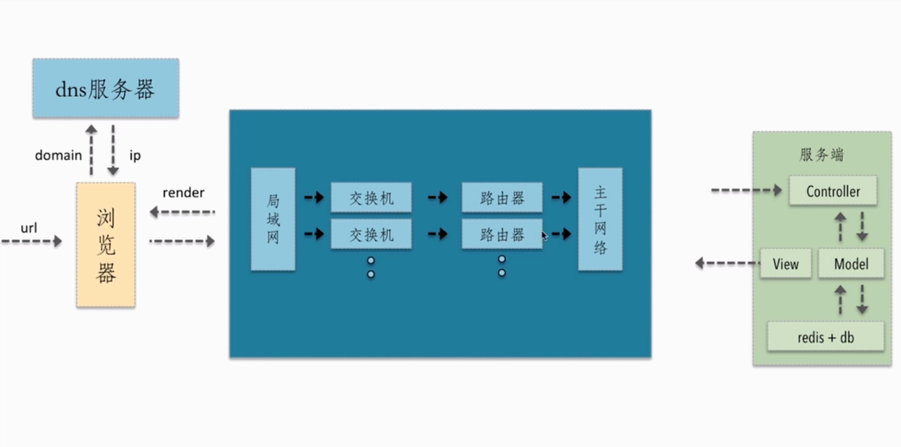
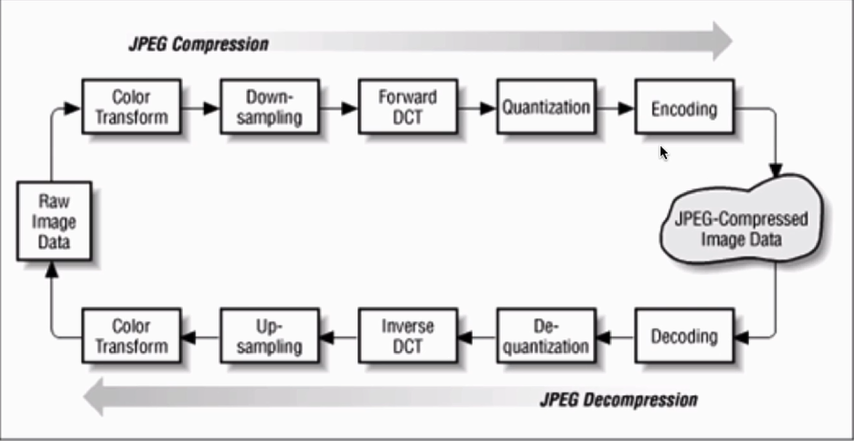
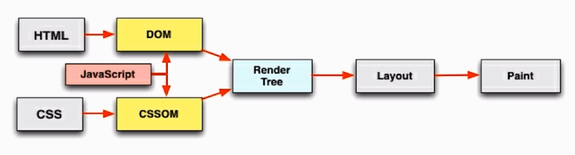
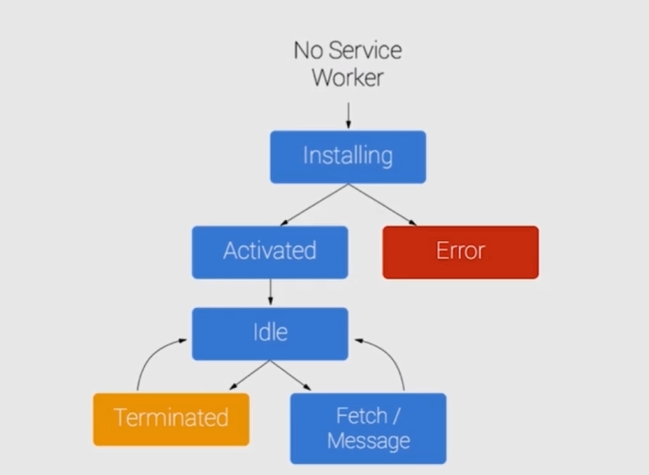
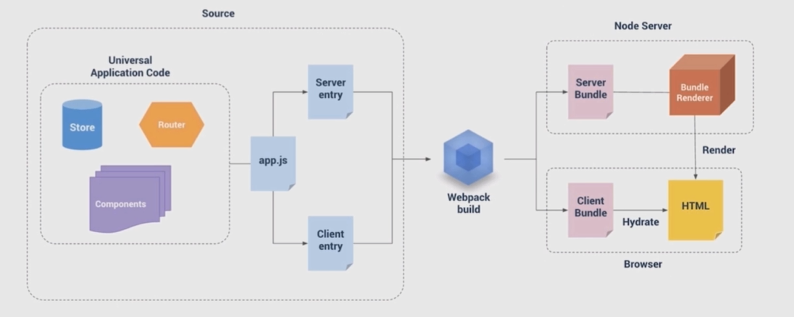

# Web前端性能优化
剖析web前端性能优化原理，分析当前大公司在性能优化上所做的实践。

### 浏览器的一个请求从发送到返回都经历了什么？


- 使用 CDN 资源时最好不好和主站域名一样，防止访问 cdn 时还携带主站cookie，避免网络无谓的损耗。
- 如何减少 http 请求的大小

### 请求过程中一些潜在的性能优化点
- dns 是否可以通过缓存减少 dns 查询时间？
- 网络请求的过程中走最近的网络环境？
- 相同静态资源是否可以缓存？
- 能否减少请求 http 请求大小？
- 减少 http 请求
- 服务端渲染

### 深入理解 http 请求过程是前端性能优化的核心

## 资源的合并与压缩
- 减少 http 请求数量
- 减少请求资源大小

### google 首页案例学习
- html 压缩
- css 压缩
- js 的压缩和混乱
- 文件合并
- 开启gzip

#### html 压缩
- HTML 代码压缩就是压缩这些在文本文件中有意义，但是在 HTML 中 **不显示**的字符，包括**空格**，**制表符**，**换行符**等，还有一些其它意义的字符，如 **HTML 注释**也可以被压缩。  
如何进行压缩：
1. 使用在线网站进行压缩
2. nodejs 提供了 html-minifier 工具
3. 后端模板引擎渲染压缩

#### CSS 压缩
- 无效代码删除
- css 语义合并  
如何进行 css 压缩：
1. 使用在线网站压缩
2. 使用 html-minifier 对html 中的 css 压缩
3. 使用 clean-css 对 css 进行压缩

#### JS 压缩与混乱
- 无效字符的删除
- 剔除注释
- 代码语义的缩减与优化
- 代码保护  
如何进行 js 压缩和混乱：
1. 使用在线网站进行压缩
2. 使用 html-minifier 对 html 中的 js 进行压缩
3. 使用 uglifyjs 对 js 进行压缩

#### 文件合并
文件合并存在的问题：
- 首屏渲染问题
- 缓存失效问题  
建议：
- 公共库合并
- 不同页面的合并
- 见机行事，随机应变  
如何进行文件合并：
1. 使用在线网站进行文件合并
2. 使用 nodejs 实现文件合并

#### 在线压缩工具
- tool.oschina.net/jacompress

#### 实战 fis3
新建 fis-conf.js

## 图片相关优化
- 理解**图片相关的优化的核心概念**
- 结合 facebook 和淘宝移动首页案例分析
- 掌握通过**在线网站**和 **fis3** 实现两种图片相关的一些优化

### 一张 JPG 图片的解析过程


### png8/png24/png32 之间的区别
- png8 —— 256色 + 支持透明
- png24 —— 2^24 色 + 不支持透明
- png32 —— 2^24 色 + 支持透明

**每种图片格式都有自己的特点，根据不同的业务场景选择不同的图片格式是很有必要的。**

### 不同格式图片常用的业务场景
- jpg 有损压缩，压缩率高，不支持透明
  - 大部分不需要透明图片的业务场景
- png 支持透明，浏览器兼容好
  - 大部分需要透明图片的业务场景
- webp 压缩程度更好，在 ios webview 有兼容性问题
  - 安卓全部
- svg 矢量图，代码内嵌相对较小
  - 图片样式相对简单的场景

### 图片压缩

#### CSS 雪碧图
优点：可以减少网站的 HTTP 请求数量
缺点：整合图片比较大时，一次加载比较慢

#### Image inline

#### 使用矢量图

#### 在安卓下使用 webp
webp 的优势体现在它具有更优的图像数据压缩算法，能带来更小的图片体积，而且拥有肉眼识别无差异的图像质量；同时具备了无损有损压缩模式、Alpha 透明以及动画的特性，在 JEPG 和 PNG 上的转化效果都非常优秀、稳定和统一。

### 图片压缩案例分析
www.iconfont.cn
https://tinypng.com

### 图片压缩实战
图片转换网站：zhitu.isux.us
在图片小于8kb的时候做一个构建工具inline 的选择
雪碧图：www.spritecow.com

## css 和 js 的装载与执行
- 理解浏览器端 html、css、js 的加载过程
- 结合 chrome 的能力学习和掌握 css、js 加载过程中的优化点
- 通过案例分析和实战演练深入理解学习的优化点

### HTML 页面加载渲染的过程


### HTML 渲染过程的一些特点
- 顺序执行、并发加载（并发度受域名限制，单个域名并发度有限）
- 是否阻塞
- 依赖关系
- 引入方式

### 顺序执行、并发加载
- 词法分析
- 并发加载
- 并发上限

### css 阻塞和 js 阻塞
- css head 中阻塞页面的渲染
- css 阻塞 js 的执行
- css 不阻塞外部脚本的加载
- 直接引入的 js 阻塞页面的渲染
- js 不阻塞资源的加载
- js 顺序执行，阻塞后续 js 逻辑的执行

### 依赖关系
- 页面渲染依赖于 css 的加载
- js 执行顺序的依赖关系
- js 逻辑对dom 节点的依赖关系

### js 引入方式
- 直接引入
- defer
- async
- 异步动态引入 js

### 加载和执行的一些优化点
- css 样式表置顶
- 用 link 代替 import
- js 脚本置底
- 合理使用 js 的异步加载能力

## 懒加载与预加载
- 理解懒加载与预加载的原理
- 懒加载与预加载案例分析
- 懒加载与预加载的案例实战

### 懒加载
- 图片进入可视区域后请求图片资源
- 对于电商等图片很多、页面很长的业务场景适用
- 减少无效资源的加载
- 并发加载资源的过多会阻塞 js 的加载，影响网站的正常使用

### 预加载
- 图片等静态资源在使用之前的提前请求
- 资源使用到时能从缓存中加载，提升用户体验
- 页面展示的依赖关系维护

### 懒加载原生 js 和 zepto.lazyload
需要去监听 scroll 事件，在 scroll 事件的回调中去判断我们懒加载的图片是否进入可视区域。
```js
// 获取可视区域的高度
var viewHeight = document.documentElement.clientHeight

function lazyload() {
	var eles = document.querySelectorAll('img[data-original][lazyload]')
	Array.prototype.forEach.call(else, function(item, index) {
		var rect
		if (item.dataset.original === '') return
		rect = item.getBoundingClientRect()

		if (rect.bottom >= 0 && rect.top < viewHeight) {
			!function() {
				var img = new Image()
				img.src = item.dataset.original
				img.onload = function() {
					item.src = img.src
				}
				item.removeAttribute('data-original')
				item.removeAttribute('lazyload')
			}()
		}
		})
}

lazyload()

document.addEventListener('scroll', lazyload)
```

### 预加载原生 js 和 PreloadJS 实现

## 重绘与回流
- 理解浏览器重绘与回流的机制
- 对于一些经典案例进行分析
- 重绘与回流的案例实战

### css 性能会让 js 变慢吗？
频繁触发**重绘**与**回流**，会导致UI 频繁渲染，最终导致js 变慢

### 什么是重绘与回流
- 回流必定引起重绘，而重绘不一定会引起回流。

#### 回流
- 当 render tree 中的一部分（或全部）因为元素的规模尺寸、布局、隐藏等的改变而需要重新构建，这就称为回流（reflow）
- 当页面布局和几何属性改变时就需要回流

#### 重绘
- 当 render tree 中的一些元素需要更新属性，而这些属性只是影响元素的外观、风格而不会影响布局，比如 background-color，则成为重绘

### 触发页面重布局的属性
- 盒子模型相关属性会触发重布局
  - width height padding margin display border-width border min-height
- 定位属性及浮动也会触发重布局
  - top bottom left right position float clear
- 改变节点内部文字结构也会触发重布局
  - text-align overflow-y font-weight overflow font-family line-height vertival-align white-space font-size

#### 只触发重绘的属性
- color border-style border-radius visibility text-decoration background background-image background-position background-repeat background-size
outline-color outline outline-style outline-width box-shadow

#### 新建 DOM 的过程
1. 获取 dom 后分割为多个图层
2. 对每个图层的节点计算样式结果（Recalculate style--样式重计算)
3. 为每个节点生成图形和位置（Layout--回流和重布局）
4. 将每个节点绘制填充到图层位图中（Paint Setup 和 Paint--重绘）
5. 图层作为纹理上传至 GPU
6. 符合多个图层到页面上生成最终屏幕图象（Composite Layers--图层重组）

将频繁重绘回流的 DOM 元素单独作为一个独立图层，那么这个 DOM 元素的重绘与回流的影响只会在这个图层中。

#### 如何将 DOM 元素变成新的独立图层？
Chrome 创建图层的条件
- 3D 或透视变换 css 属性（perspective transform）
- 使用加速视频解码的 `<video>` 节点
- 拥有 3D（WebGL）上下文或加速的 2D 上下文的 canvas 节点
- 混合插件（如 Flash）
- 对自己的 opacity 做 css 动画或使用一个动画 webkit 变换的元素
- 拥有加速 css 过滤器的元素
- 元素有一个包含复合层的后代节点（一个元素拥有一个子元素，该子元素在自己的图层里）
- 元素有一个  z-index 较低且包含一个复合层的兄弟元素（换句话说就是该元素在复合层上面渲染）

避免使用触发重绘回流的 css 属性
将重绘、回流的影响范围限制在单独的图层之内

### 实战优化点
- 用 translate 替代 top 改变
- 用opacity 替代 visibility
- 不要一条一条地修改 DOM 的样式，预先定义好 class，然后修改 DOM 的 className
- 把 DOM 离线后修改，比如：先把 DOM 给 display：none（有一次reflow）然后你修改一百次然后再把它显示出来
- 不要把 DOM 结点的属性值放在一个循环里当成循环里的变量
- 不要适用 table 布局，可能很小的一个改动会造成整个 table 的重新布局
- 动画实现的速度的选择
- 对于动画新建图层
- 启用 GPU 硬件加速

## 浏览器存储
- 理解 localstorage、cookie、session storage、indexdb的概念和使用
- 学习理解 pwa 和 service worker 的应用
- 案例分析和实战

### cookie
因为 HTTP 请求无状态，所以需要 cookie 去维持客户端状态。

cookie 的生成方式：
- http response header 中的 set-cookie
- js 中可以通过 document.cookie 去读写 cookie

1. 用于浏览器和服务端的交互
2. 客户端自身的数据存储

过期时间 expire

#### cookie存储的限制
- 作为浏览器存储，大小4kb左右
- 需要设置过期时间 expire

cdn 域名要和主站域名分开

### local storage
- HTML5 设计出来专门用于浏览器存储
- 大小为5M左右
- 仅在客户端使用，不和服务端进行通信
- 接口封装较好
- 浏览器本地缓存方案

### session storage
- 会话级别的浏览器存储
- 大小为 5M 左右
- 仅在客户端使用，不和服务端进行通信
- 接口封装较好
- 用于表单信息的维护

### IndexedDB
- IndexedDB 是一种低级API，用于客户端存储大量结构化数据。该 API 使用索引来实现对该数据的高性能搜索。虽然webstorage对于存储叫少量的数据很有用，但对于存储更大量的结构化数据来说，这种方法不太有用。IndexedDB 提供了一个解决方案。
- 为应用创建离线版本

### Service workers 产生的意义
在后台或者其他线程中进行相关的大规模的数据运算和获取，获取了之后将数据返回到主线程，避免主线程被巨大的逻辑阻塞。

### PWA
- PWA（Progressive Web Apps）是一种 Web App 新模型，并不是具体指某一种前沿的技术或者某一个单一的知识点，我们从英文缩写来看就能看出来，这是一个渐进式的 Web App，是通过一系列新的 Web 特性，配合优秀的 UI 交互设计，逐步的增强 Web App 的用户体验。
- 可靠性：在没有网络的环境中也能提供页面的基本访问，而不会出现“未连接到网络”的页面。
- 快速：针对网络渲染及网络数据访问有较好优化。
- 融入（Engaging）：应用可以被增加到手机桌面，并且和普通应用一样有全屏和推送等特性。
- lighthouse（下载地址：https://lavas.baidu.com/doc-assets/lavas/vue/more/downloads/lighthouse_2.1.0.zip ）

### Service Workers
- Service Workers 是一个脚本，浏览器独立与当前网页，将其在后台运行，为实现一些不依赖页面或用户交互的特性打开了一扇大门。在未来这些特性将包括推送消息，背景后台同步，geofencing（地理围栏定位），当他推出的第一个首要特性，就是拦截和处理网络请求的能力，包括以编程的形式来管理被缓存的相应。

1. 使用拦截和处理网络请求的能力，去实现一个离线应用
2. 使用Service Worker 在后台运行同时能和页面进行通信的能力，去实现大规模后台数据的处理

#### service worker 生命周期


### chrome 中检查浏览器中启动的 serviceworker以及内置的
- chrome://serviveworker-internals/
- chrome://inspect/#service-workers

## 缓存优化
- 理解 cache-control 所控制的缓存策略
- 学习理解 last-modified 和 etag 以及整个服务端浏览器端的缓存流程
- 案例分析和实战，基于 node 实践上述缓存方式

### cache-control
- max-age
- s-maxage
- private
- public
- no-cache
- no-store

### expires
- 缓存过期时间，用来指定资源到期的时间，是服务器端的具体时间点
- 告诉浏览器在过期时间前，浏览器可以直接从缓存里取数据，而无需再次请求

### Last-Modified/If-Modified-Since
- 基于客户端和服务端协商的缓存机制
- last-modified —— response header
- if-modified-since —— request header
- 需要与 cache-control 共同使用

#### Last-Modified 有什么缺点
- 某些服务器不能够获取精确的修改时间
- 文件修改时间变了，但文件内容却没有变

### ETag/If-None-Match
- 文件内容的 hash 值

### 分级缓存策略


## SSR 服务端渲染
- vue 渲染面临的问题时什么？

### 多层次的优化方案
- 构建层模板编译
- 数据无关的 prerender 的方式
- 服务端渲染

### Server Side Rendering
with streaming support + component caching

